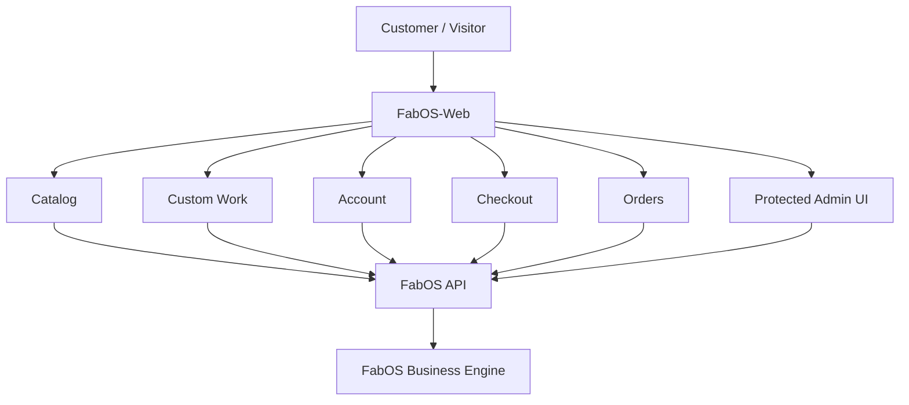
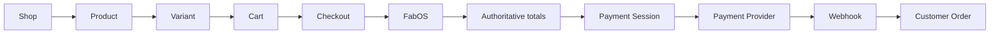
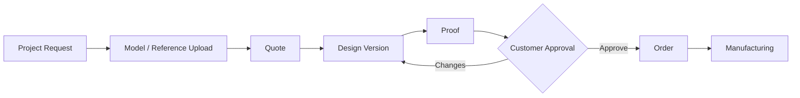

# FabOS-Web

**FabOS-Web is the web application layer for FABVEX.**

It provides the customer storefront, custom-work request experience, customer account portal, quotes, checkout, order tracking, and protected business/admin web surfaces while relying on **FabOS** for authoritative business logic and persistence.

[FabOS](https://github.com/Energex22/FabOS) is the backend/business operating system. FabOS-Web must not become a second implementation of pricing, customer ownership, payment state, production state, or fulfillment rules.

## Visual overview

The diagrams below show the role of FabOS-Web without hiding the important boundary: the browser provides the experience, while FabOS owns the business decisions.

### What the web application is

### A normal purchase

### Custom work

For exact UI screenshots, the best source is the running FabOS-Web application itself. We can add those after a stable build is available; unlike architecture diagrams, screenshots should represent a specific released UI and therefore need to be refreshed when the interface changes.

## What FabOS-Web provides

| Area | Current role |
| --- | --- |
| **Storefront** | Home page, shop, categories, product discovery |
| **Products** | Product details, variants, configuration |
| **Custom work** | Custom project request and model upload workflow |
| **Customers** | Registration, login, logout, profile |
| **Quotes** | Quote submission, review, acceptance/decline and proof workflow |
| **Checkout** | Cart convenience state, shipping details, server-side order creation, payment-session start |
| **Orders** | Customer order history, details, customer-safe progress and fulfillment information |
| **Admin/business** | Protected administrative workflows backed by FabOS |
| **Deployment** | Windows/Linux + Caddy deployment assets and production guidance |

## Architecture

~~~mermaid
flowchart TB
    Brand[FABVEX] --> Web[FabOS-Web]
    Web --> Storefront[Storefront]
    Web --> Portal[Customer Portal]
    Web --> Admin[Admin Web UI]
    Web --> HTTPS[HTTPS / JSON]
    HTTPS --> FabOS[FabOS]
    FabOS --> Rules[Business Rules]
    FabOS --> DB[Database]
    FabOS --> Vault[Design Vault]
    FabOS --> Payments[Payments]
    FabOS --> Production[Production]
~~~

### Source of truth

FabOS-Web is intentionally **not authoritative** for:

- prices;
- tax;
- shipping;
- payment state;
- customer ownership;
- account permissions;
- order status;
- production status;
- fulfillment state;
- catalog eligibility.

The browser may retain convenience state such as a cart, but FabOS revalidates the important values when the request reaches the server.

## Customer workflows

### Standard product order

~~~mermaid
flowchart TB
    Shop[Shop] --> Product[Product]
    Product --> Variant[Variant / configuration]
    Variant --> Cart[Cart]
    Cart --> Checkout[Checkout]
    Checkout --> FabOS[FabOS creates / recalculates order]
    FabOS --> Session[Payment session]
    Session --> Provider[Payment provider]
    Provider --> Webhook[FabOS webhook / reconciliation]
    Webhook --> Status[Customer order status]
~~~

### Custom work

~~~mermaid
flowchart TB
    Custom[Custom Work] --> Details[Project details]
    Details --> Upload[Optional model / reference upload]
    Upload --> Quote[FabOS quote]
    Quote --> Vault[Design Vault]
    Vault --> Pricing[Quote / pricing]
    Pricing --> Proof[Design proof]
    Proof --> Approval[Customer approval]
    Approval --> Order[Order]
    Order --> Production[Production]
~~~

### Customer design proof

When a custom order requires a proof, the customer reviews the specific design version sent by FABVEX.

The customer can:

- approve the proof;
- request changes with a comment.

FabOS records the approval/change request and production remains blocked until the required latest proof is approved.

## Application surfaces

Current customer-facing and business entry points include:

| Path | Purpose |
| --- | --- |
| / | Main landing page, shop preview, custom-work CTA and FAQ |
| /shop.html | Searchable product catalog |
| /product.html?id=... | Product and variant/configuration experience |
| /custom-work.html | Custom project request flow |
| /checkout.html | Cart, customer/shipping information and checkout |
| /orders.html | Customer order history |
| /order.html?id=... | Customer order details and progress |
| /account.html | Customer account/profile area |
| /quote.html | Quote/proof-related customer workflow |
| /admin.html | Protected business/admin web surface |
| /about.html | About page |
| /faq.html | Frequently asked questions |

The exact route behavior is implementation detail; the backend API remains the authoritative contract.

## Backend API boundary

src/api.js is the single frontend adapter boundary for FabOS customer HTTP operations.

The frontend uses FabOS for:

- catalog;
- categories;
- product details;
- authentication;
- customer profile;
- quotes;
- quote acceptance/decline;
- custom quote requests;
- model uploads;
- orders;
- payment-session creation;
- customer design proofs;
- customer-safe order status.

See [docs/FABOS_API_CONTRACT.md](docs/FABOS_API_CONTRACT.md) and the backend contract in [FabOS](https://github.com/Energex22/FabOS/blob/main/docs/CUSTOMER_API_CONTRACT.md).

### Customer-safe data boundary

The frontend should never receive internal:

- production jobs;
- printer data;
- staff notes;
- audit information;
- internal dossier details;
- Design Vault filesystem paths;
- payment credentials;
- provider secrets;
- another customer's data.

Customer ownership is enforced by FabOS.

## Custom model uploads

Current supported model/reference formats:

- STL
- 3MF
- OBJ
- STEP/STP

Maximum upload size: **25 MB**.

The frontend sends the file through the supported FabOS upload endpoint. FabOS validates and stores it in the Design Vault rather than exposing an internal filesystem location.

## Checkout and pricing

The cart is convenience state.

FabOS remains authoritative for:

- product eligibility;
- active variants;
- unit pricing;
- tax;
- shipping;
- order totals;
- payment state.

The browser must never be trusted to supply an authoritative total.

Checkout creates the server-side order first and then requests a payment session. If the payment provider is not configured, the frontend must not present a fake success state.

## Payment model

Stripe is the primary online payment processor for the current FabOS architecture.

FabOS-Web does **not** receive or store raw card information.

The frontend only requests a backend payment session and follows the provider's checkout flow. Payment webhooks reconcile the resulting state in FabOS.

See [docs/FABOS_API_CONTRACT.md](docs/FABOS_API_CONTRACT.md) and FabOS [docs/PAYMENTS.md](https://github.com/Energex22/FabOS/blob/main/docs/PAYMENTS.md).

## Technology stack

The frontend currently uses:

- React 19.3.x;
- Vite 8.3.x;
- Lucide React 1.47.x;
- Node.js 24.x;
- npm 11.x.

`package.json` currently reports frontend package version `0.1.0`; this is independent of the FabOS application version and should only be changed as part of a coordinated release/versioning decision.

The backend is FabOS, which provides the business/API layer.

## Development setup

### Prerequisites

Install:

- Node.js 24.x;
- npm 11.x;
- FabOS for the backend API when using live customer flows.

Check versions:

~~~bash
node --version
npm --version
~~~

Install dependencies:

~~~bash
npm install
~~~

Start the Vite development server:

~~~bash
npm run dev
~~~

The frontend expects the FabOS API to be available according to the configured API base.

### Windows one-click starter

For a local Windows development session:

~~~text
start-fabos-web.bat
~~~

The starter can install npm dependencies, start the local development server, wait for it to respond, and open the site.

A silent launcher is also available:

~~~text
start-fabos-web-hidden.vbs
~~~

If Node.js is missing, the launcher should explain the prerequisite rather than silently failing.

## Building for production

Run:

~~~bash
npm test
npm run build
~~~

The Vite build produces the web assets used by the Caddy deployment.

## Production deployment

The supported production model keeps FabOS private and places Caddy in front of both the static frontend and API:

~~~mermaid
flowchart TB
    Internet[Internet] --> HTTPS[HTTPS]
    HTTPS --> Caddy[Caddy]
    Caddy --> Web["/ -> FabOS-Web static files"]
    Caddy --> API["/api/* -> FabOS on 127.0.0.1:8000"]
~~~

This gives the customer browser a single origin.

### Important production rules

- Use HTTPS.
- Keep the FabOS API bound to localhost/private networking.
- Do not expose port 8000 directly.
- Do not expose the Vite development server directly.
- Do not expose the FabOS desktop/admin application through the public web site.
- Never put Stripe secret keys or other private credentials in Vite VITE_* variables.
- Anything shipped in a Vite VITE_* variable is browser-visible.
- Keep persistent FabOS data and the Design Vault outside the frontend repository.

Production deployment documentation:

- [deployment/windows/README.md](deployment/windows/README.md)
- [deployment/windows/DOMAIN_AND_HTTPS.md](deployment/windows/DOMAIN_AND_HTTPS.md)
- [DEPLOYMENT.md](DEPLOYMENT.md)

The deployment assets include Windows and Linux + Caddy paths; use the platform-specific instructions rather than assuming the development server is a production server.

## Domain, DNS and HTTPS

For a home/small-business deployment, the main prerequisites are:

1. A hostname pointing to the deployment.
2. A reachable public HTTPS endpoint, or an outbound tunnel.
3. Caddy configured to serve the frontend and proxy /api/*.
4. A persistent FabOS data directory.
5. A tested backup/restore procedure.

If normal inbound port forwarding is unavailable because of CGNAT or ISP restrictions, use an outbound tunnel or another supported reverse-proxy strategy instead of exposing the FabOS API directly.

See [deployment/windows/DOMAIN_AND_HTTPS.md](deployment/windows/DOMAIN_AND_HTTPS.md).

## API configuration

The supported same-origin production configuration is:

~~~text
VITE_API_URL=/api
~~~

A same-origin relative API path avoids requiring the browser to contact a separately exposed API hostname.

Development or alternative deployments can supply a different API base when intentionally configured.

Do not put:

- Stripe secret keys;
- OAuth refresh tokens;
- printer API keys;
- AI provider keys;
- marketplace secrets

into frontend environment variables.

## Shared frontend state

The frontend contains shared modules for:

- catalog/product data and lookups;
- cart convenience state;
- customer API contracts;
- customer authentication/profile state;
- quote workflows;
- order presentation/status mapping.

Some modules originated as prototype/browser-local stores. They must not be interpreted as authoritative persistence.

The production-connected flow is:

**browser UI -> FabOS API -> FabOS services/database**

not:

**browser UI -> browser storage -> business truth**

## Repository structure

~~~text
FabOS-Web/
├── src/                 Frontend application logic
├── public/              Static assets
├── test/                Frontend tests
├── docs/                API and frontend documentation
├── deployment/          Windows/Linux production assets
├── *.html               Application entry points
├── package.json         Node/npm configuration
└── vite.config.*        Vite build configuration
~~~

The repository contains additional modules and deployment files beyond this simplified view.

## First-run / production setup

For the current Windows production path, FabOS should be initialized and configured before the public storefront is exposed. The backend setup flow includes owner creation, payment configuration, backup creation/verification, and production preflight checks.

Recommended order:

1. Initialize the FabOS data directory.
2. Create the initial owner/admin and change any bootstrap credentials.
3. Configure products, Ready-to-Print eligibility, tax and shipping.
4. Configure Stripe test-mode credentials and webhook signing secret.
5. Configure printers/OctoPrint only after local printing is known-good.
6. Build FabOS-Web with `VITE_API_URL=/api`.
7. Start the local FastAPI service behind Caddy.
8. Run the customer acceptance and recovery tests.
9. Verify a backup and test restore before live orders.
10. Switch to live payment credentials only after the test flow passes.

See FabOS [production readiness](https://github.com/Energex22/FabOS/blob/main/docs/PRODUCTION_READINESS.md) and [Windows deployment](deployment/windows/README.md).

## Testing and verification

Run the frontend tests:

~~~bash
npm test
~~~

Run the production build:

~~~bash
npm run build
~~~

For an actual deployment, also verify:

- catalog loading;
- product detail;
- account registration/login/logout;
- custom quote request;
- model upload;
- quote retrieval;
- design proof approval/change request;
- checkout;
- server-side order creation;
- payment test mode;
- duplicate webhook handling;
- customer order visibility;
- failed payment;
- refund;
- HTTPS;
- API privacy;
- backup/restore.

A successful frontend build does not prove the backend, payment provider, DNS, TLS, printer, or production deployment is configured correctly.

## Documentation

| Document | Purpose |
| --- | --- |
| [DEPLOYMENT.md](DEPLOYMENT.md) | General deployment model |
| [docs/FABOS_API_CONTRACT.md](docs/FABOS_API_CONTRACT.md) | Frontend/backend API contract |
| [deployment/windows/README.md](deployment/windows/README.md) | Windows deployment and pre-launch checks |
| [deployment/windows/DOMAIN_AND_HTTPS.md](deployment/windows/DOMAIN_AND_HTTPS.md) | DNS, HTTPS and Caddy setup |
| [FabOS production readiness](https://github.com/Energex22/FabOS/blob/main/docs/PRODUCTION_READINESS.md) | Backend acceptance/recovery gate |
| [FabOS customer API contract](https://github.com/Energex22/FabOS/blob/main/docs/CUSTOMER_API_CONTRACT.md) | Backend-side source of truth |

## Design principles

### One business engine

Business rules belong in FabOS rather than being reimplemented in the frontend.

### Server-authoritative state

Anything that affects money, ownership, permissions, production or fulfillment must be validated by FabOS.

### Customer-safe API

Internal operational information should be filtered at the API boundary rather than merely hidden by the UI.

### Same-origin production

Serving the frontend and proxying /api/* through Caddy keeps the public architecture simple and minimizes the need for public CORS configuration.

### Progressive disclosure

Customers should see the information needed to complete and understand their order without being exposed to internal manufacturing, staff, audit or infrastructure details.

## Roadmap

Current web development is focused on continuing to expand the customer and business workflows around the established FabOS API:

- richer storefront/product experiences;
- more complete customer quote/proof workflows;
- expanded checkout/payment UX;
- deeper customer order tracking;
- broader administrative web capabilities;
- additional marketing/business surfaces;
- improved responsive/mobile presentation;
- tighter integration with FabOS automation and production workflows.

## Contributing

When changing FabOS-Web:

1. Preserve the FabOS API contract.
2. Do not duplicate backend business rules in the browser.
3. Treat browser state as convenience state unless explicitly documented otherwise.
4. Keep secrets out of Vite/browser-visible configuration.
5. Add/update tests for changed behavior.
6. Run npm test and npm run build before considering a change complete.
7. Update this README or the appropriate detailed documentation when a public workflow or deployment requirement changes.

## License

The repository's licensing terms should be kept synchronized with the repository's actual license file. Do not assume a license from this README alone.
